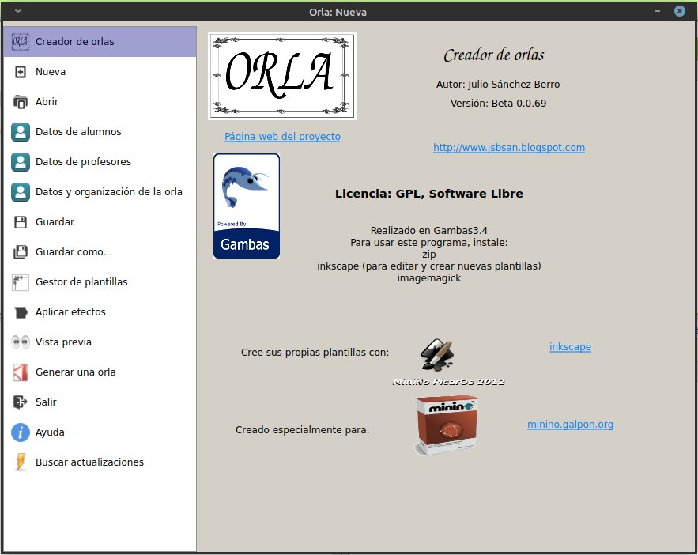
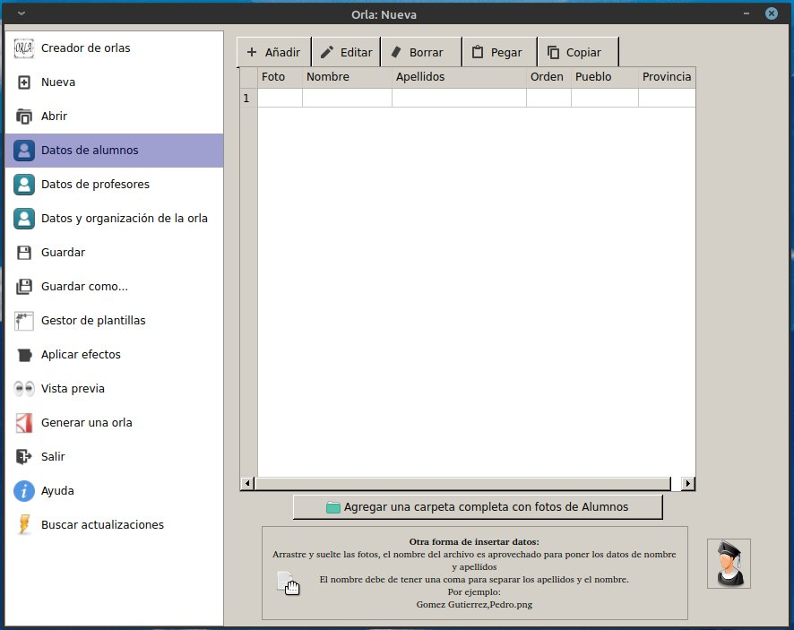
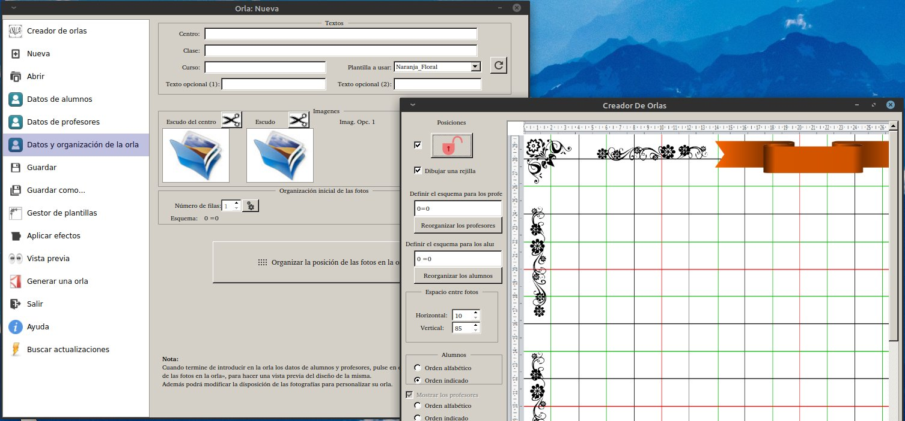
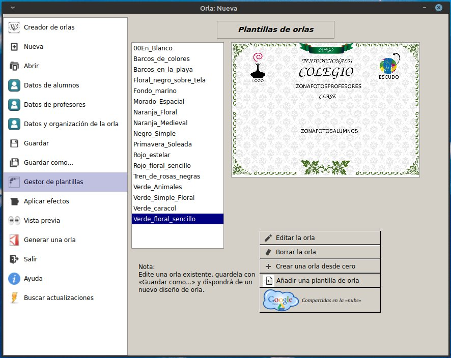
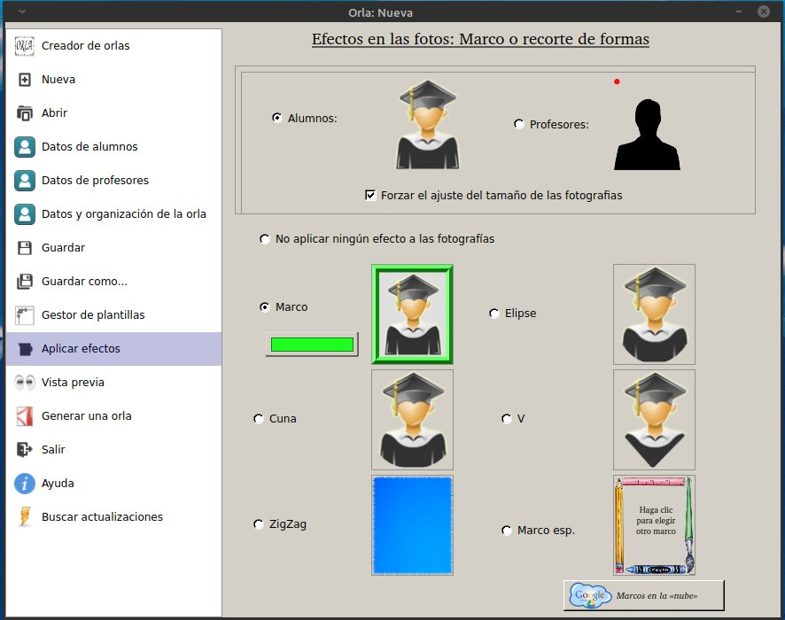
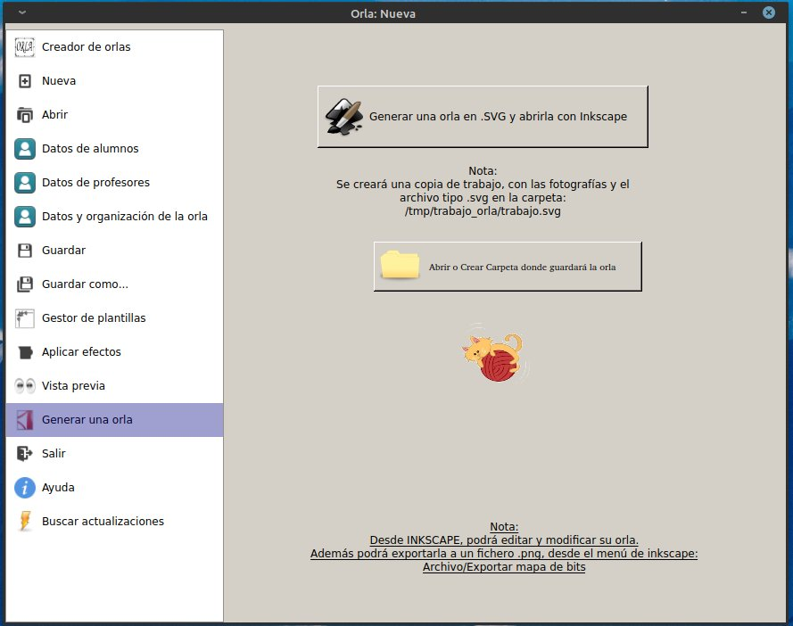

# Creador de Orlas

Programa realizado en gambas3, para hacer orlas de estudiantes, enfocados para orlas infantiles o con pequeño número de alumnos (alrededor de 40 alumnos).

El programa es completamente funcional, y exporta la salida a archivos .svg y .pdf



Añade los datos de los alumnos y profesores:


Elige la plantilla y puedes posicionar las fotos de los alumnnos y profesores, automaticamente o manualmente:



En el gestor de plantillas puedes ver las plantillas disponibles:


En aplicar efectos, puedes poner marcos a las fotos de los alumnos y profesores:


En generar orlas puedes obtener el fichero .svg de la orla y/o el formato pdf de la orla generada por el programa.


Blog del proyecto: http://creadordeorlas.blogspot.com.es/
donde puedes ver videos tutoriales del uso del programa completo.

### Pre-requisitos 📋

Debes de tener instalado gambas3.15.
Puedes usar el PPA:

```
sudo add-apt-repository ppa:gambas-team/gambas3  
sudo apt-get update
sudo apt-get install gambas3
```

### Instalación 🔧

Puedes seguir los pasos indicados en este [enlace][enlace]:

[enlace]: https://gist.github.com/Nando98/2cd5fc89cb7cfbe9b5fba56220d05307

## Autores ✒️

* **Julio Sanchez Berro** 

## Licencia 📄

GPLv3
